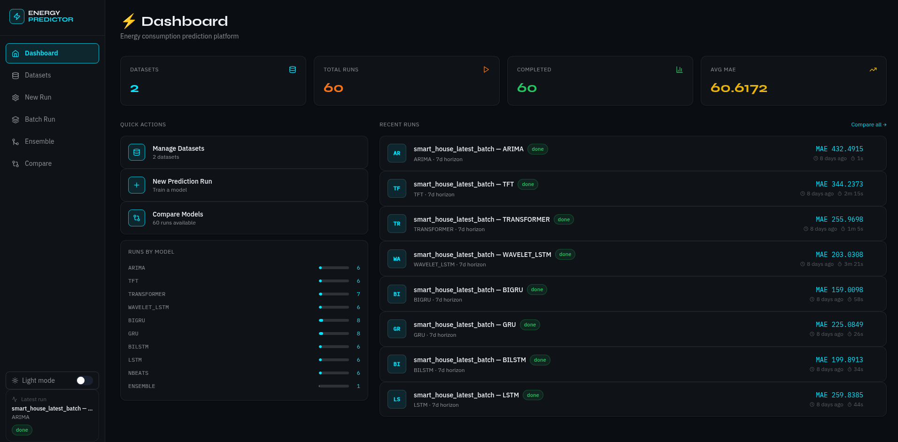
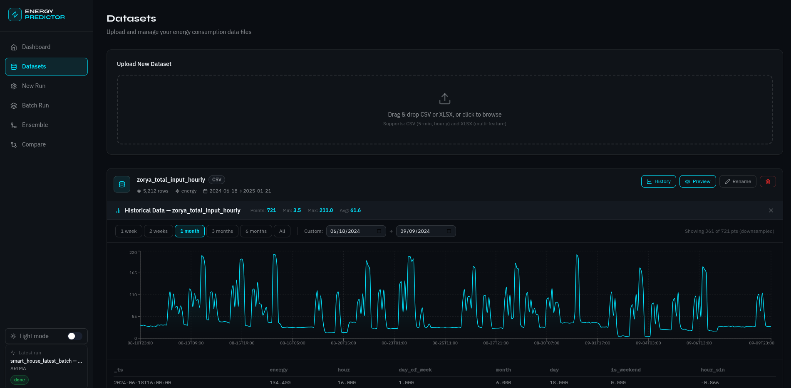
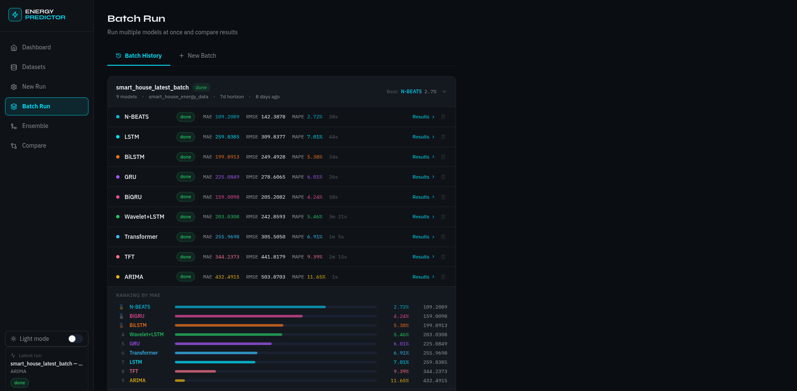
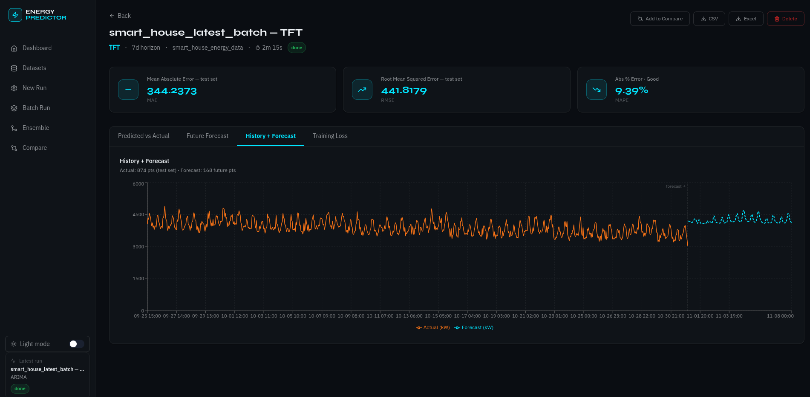

# ⚡ Energy Predictor

A full-stack energy consumption prediction platform with **10 forecasting models**, a React dashboard, live training logs, batch runs, stacking ensembles, and CSV/Excel export.

---

## Screenshots

### Dashboard


### Datasets


### Batch Run


### Results


---

## 🐳 Docker (recommended)

### Prerequisites
- Docker 24+ and Docker Compose v2

### Production — one command

```bash
docker-compose up --build
```

| Service | URL |
|---|---|
| **UI** | http://localhost |
| **API** | http://localhost:8000 |
| **API docs** | http://localhost:8000/docs |

All data (SQLite DB, uploaded datasets, model runs) is persisted in a named Docker volume `energy_storage`.

### Development — hot reload for both services

```bash
docker-compose -f docker-compose.yml -f docker-compose.dev.yml up --build
```

- Backend: FastAPI with `--reload` watching source files → http://localhost:8000
- Frontend: Vite dev server with HMR → http://localhost:5173

### Useful Docker commands

```bash
# Start in background
docker-compose up -d --build

# View logs
docker-compose logs -f
docker-compose logs -f backend
docker-compose logs -f frontend

# Restart a single service
docker-compose restart backend

# Stop everything
docker-compose down

# Stop and wipe all data (volumes)
docker-compose down -v

# Rebuild after code changes
docker-compose up --build

# Open a shell in the backend container
docker-compose exec backend bash

# Run CLI commands inside the container
docker-compose exec backend python -m cli.predict models
docker-compose exec backend python -m cli.predict dataset list
docker-compose exec backend python -m cli.predict run list
```

### Environment variables

Copy `.env.example` to `.env` to customise:

```bash
cp .env.example .env
```

| Variable | Default | Description |
|---|---|---|
| `DATABASE_URL` | `sqlite:////app/storage/energy_predictor.db` | SQLite path |
| `DATA_DIR` | `/app/storage/data` | Uploaded dataset storage |
| `RUNS_DIR` | `/app/storage/runs` | Model run artifacts |
| `CORS_ORIGINS` | `http://localhost,http://localhost:80` | Allowed frontend origins |
| `DEBUG` | `false` | FastAPI debug mode |

---

## 🖥 Local Development (without Docker)

### Backend

```bash
cd backend
python -m venv .venv && source .venv/bin/activate    # Windows: .venv\Scripts\activate
pip install -r requirements.txt
uvicorn main:app --host 0.0.0.0 --port 8000 --reload
```

### Frontend

```bash
cd frontend
npm install
npm run dev
```

---

## CLI Usage

Run from `backend/` (venv activated), or inside the Docker container via `docker-compose exec backend`:

```bash
# One-shot: upload + train + results
python -m cli.predict predict data_set.csv --model wavelet_lstm --horizon 7

# Dataset management
python -m cli.predict dataset upload hospital_building_dataset.xlsx --name "Hospital 2023"
python -m cli.predict dataset list
python -m cli.predict dataset info 1
python -m cli.predict dataset preview 1 --rows 20
python -m cli.predict dataset delete 1

# Run management
python -m cli.predict run create --dataset 1 --model bilstm --horizon 7 --name "BiLSTM test"
python -m cli.predict run list
python -m cli.predict run results 3 --forecast
python -m cli.predict run compare "1,2,3,4"
python -m cli.predict run delete 2

# Export results
python -m cli.predict export 1 --format csv
python -m cli.predict export 1 --format excel --out my_results.xlsx

# Show all models and their default hyperparameters
python -m cli.predict models

# Custom hyperparameters via JSON (works for any model)
python -m cli.predict predict data.csv \
  --model lstm \
  --params '{"epochs": 100, "lookback": 48, "units_1": 128, "dropout": 0.3}'

python -m cli.predict predict data.csv \
  --model nbeats \
  --params '{"lookback": 168, "stack_types": "trend,seasonality,generic", "num_blocks": 3}'

python -m cli.predict predict data.csv \
  --model tft \
  --params '{"d_model": 64, "n_heads": 4, "lookback": 48}'
```

---

## Supported Models

Ten models are available, from classical statistics to state-of-the-art deep learning. All neural models share the same training pipeline (EarlyStopping, ReduceLROnPlateau, configurable optimizer) and produce identical output (MAE, RMSE, MAPE, test predictions, forecast).

| Model | Key | Architecture | Best for | Default lookback |
|---|---|---|---|---|
| ARIMA / SARIMAX | `arima` | Classical ARIMA(p,d,q) with optional seasonal order | Univariate series, fast baseline, seasonal patterns | — |
| LSTM | `lstm` | 2-layer LSTM + dense head | General multivariate forecasting | 24 h |
| BiLSTM | `bilstm` | Bidirectional LSTM (concat merge) | Higher accuracy at the cost of extra parameters | 24 h |
| GRU | `gru` | 2-layer GRU + dense head | Faster training than LSTM, comparable accuracy | 24 h |
| BiGRU | `bigru` | Bidirectional GRU (concat merge) | Best of both: bidirectional context + GRU efficiency | 24 h |
| Wavelet+LSTM | `wavelet_lstm` | DWT (db4/haar/sym8) feature extraction → 2-layer LSTM | Noisy signals, multi-frequency energy patterns | 168 h |
| Transformer | `transformer` | Sinusoidal PE + N × encoder blocks (MHA + FFN) → GAP → Dense | Long-range dependencies | 48 h |
| TFT | `tft` | Variable Selection → GRN → LSTM encoder → MHA → Dense | Multivariate with interpretable feature importance | 48 h |
| N-BEATS | `nbeats` | Doubly-residual stacks (trend / seasonality / generic) | Interpretable decomposition, strong univariate baseline | 168 h |
| Ensemble | `ensemble` | Stacking meta-learner (Ridge / mean / weighted-MAPE) over finished runs | Combining complementary models for best accuracy | — |

### Shared neural training options

| Parameter | Default | Description |
|---|---|---|
| `train_split` | `0.8` | Fraction used for training |
| `validation_split` | `0.1` | Fraction of training used for validation |
| `optimizer` | `adam` | `adam` / `adamw` / `sgd` / `rmsprop` |
| `learning_rate` | `0.001` | Initial learning rate |
| `early_stopping` | `true` | Stop when val_loss plateaus |
| `es_patience` | `10` | Epochs before early stop |
| `reduce_lr` | `true` | Reduce LR on plateau |
| `lr_factor` | `0.5` | LR multiplier on plateau |
| `lr_patience` | `5` | Epochs before LR reduction |

### Wavelet+LSTM approach

1. Apply `pywt.wavedec(energy, wavelet='db4', level=2)` to extract approximation + detail coefficients
2. Concat into a fixed 10-element global feature vector
3. Tile across all timesteps and concatenate with scaled time features
4. Feed into 2-layer LSTM (64→32 units, 20% dropout)

### N-BEATS approach

1. Build stacks of type `trend`, `seasonality`, and `generic` (configurable via `stack_types`)
2. Each block outputs a **backcast** (explained portion of input) and a **forecast** contribution
3. Residual connection: each block sees only the unexplained remainder from the previous block
4. Final forecast = sum of all block forecasts (doubly-residual boosting)

### Stacking Ensemble approach

1. Load `test_predicted_json` from each selected base run
2. Align all predictions to common timestamps (inner join)
3. Fit a **Ridge regression** meta-learner on stacked test predictions → actual values
4. Blend out-of-sample forecasts using the learned coefficients
5. Alternative blending: `mean` (equal weights) or `weighted_mape` (weight = 1/MAPE)

---

## Project Structure

```
energy-predictor/
├── docker-compose.yml            Production stack
├── docker-compose.dev.yml        Dev override (hot reload)
├── .env.example                  Environment template
├── backend/
│   ├── Dockerfile                Multi-stage Python build
│   ├── main.py                   FastAPI app
│   ├── config.py                 Settings (env-aware)
│   ├── schemas.py                Pydantic models
│   ├── requirements.txt
│   ├── core/
│   │   ├── database.py           SQLAlchemy models
│   │   ├── preprocessing.py      CSV/XLSX ingestion
│   │   ├── seq_utils.py          Sliding window, scaling, wavelet utils
│   │   ├── train_utils.py        Callbacks, optimizer factory, split helpers
│   │   └── training_runner.py    Async training + SSE log stream
│   ├── models/
│   │   ├── base.py               BasePredictor ABC + PredictionResult dataclass
│   │   ├── arima_model.py        ARIMA / SARIMAX
│   │   ├── lstm_model.py         2-layer LSTM
│   │   ├── bilstm_model.py       Bidirectional LSTM
│   │   ├── gru_model.py          GRU (inherits LSTM pipeline)
│   │   ├── bigru_model.py        Bidirectional GRU
│   │   ├── wavelet_lstm_model.py DWT feature extraction + LSTM
│   │   ├── transformer_model.py  Vanilla Transformer encoder
│   │   ├── tft_model.py          Temporal Fusion Transformer
│   │   ├── nbeats_model.py       N-BEATS doubly-residual stacks
│   │   ├── ensemble_model.py     Stacking ensemble (Ridge / mean / weighted-MAPE)
│   │   └── __init__.py           REGISTRY + DEFAULT_HYPERPARAMS
│   ├── api/routes/
│   │   ├── datasets.py
│   │   ├── runs.py
│   │   └── export.py
│   └── cli/predict.py            Typer CLI
└── frontend/
    ├── Dockerfile                Multi-stage Node → nginx
    ├── Dockerfile.dev            Vite dev server
    ├── nginx.conf                Nginx: SPA + /api proxy + SSE
    ├── vite.config.js
    └── src/
        ├── pages/
        │   ├── Dashboard.jsx     Overview: recent runs + quick stats
        │   ├── Datasets.jsx      Upload, preview, rename, delete datasets
        │   ├── Configure.jsx     Model + hyperparameter configuration
        │   ├── Training.jsx      Live SSE log stream during training
        │   ├── Results.jsx       Charts, metrics, forecast table + export
        │   ├── Compare.jsx       Side-by-side metric comparison (bar charts)
        │   ├── BatchRun.jsx      Run all models on one dataset in one click
        │   └── Ensemble.jsx      Build stacking ensemble from finished runs
        └── api/client.js
```

---

## UI Pages

| Page | Route | Description |
|---|---|---|
| Dashboard | `/` | Overview of recent runs with status badges and quick-access links |
| Datasets | `/datasets` | Upload CSV/XLSX, preview rows, rename, and delete datasets |
| Configure | `/configure` | Choose model, set forecast horizon and hyperparameters, then launch |
| Training | `/training/:id` | Real-time SSE log stream while the model trains |
| Results | `/results/:id` | Interactive forecast chart, test-vs-actual chart, metric cards, export |
| Compare | `/compare` | Side-by-side MAE/RMSE/MAPE bar charts across multiple runs |
| Batch Run | `/batch` | Select any combination of models + one dataset, train them all at once |
| Ensemble | `/ensemble` | Pick finished runs, choose blend method, launch stacking ensemble |

---

## REST API

| Method | Endpoint | Description |
|---|---|---|
| GET | `/api/health` | Health check |
| POST | `/api/datasets/upload` | Upload CSV/XLSX |
| GET | `/api/datasets/` | List datasets |
| GET | `/api/datasets/{id}/preview` | Preview rows |
| PUT | `/api/datasets/{id}` | Rename/update |
| DELETE | `/api/datasets/{id}` | Delete dataset |
| POST | `/api/runs/` | Create a run (single model or ensemble) |
| POST | `/api/runs/{id}/start` | Start training |
| GET | `/api/runs/{id}/logs` | SSE live log stream |
| GET | `/api/runs/` | List all runs |
| GET | `/api/runs/{id}` | Get run + result |
| DELETE | `/api/runs/{id}` | Delete run |
| GET | `/api/runs/compare/metrics?run_ids=1,2,3` | Compare metrics across runs |
| GET | `/api/export/{id}/csv` | Download results as CSV |
| GET | `/api/export/{id}/excel` | Download results as Excel |
| GET | `/api/models/defaults` | Default hyperparams for all models |
